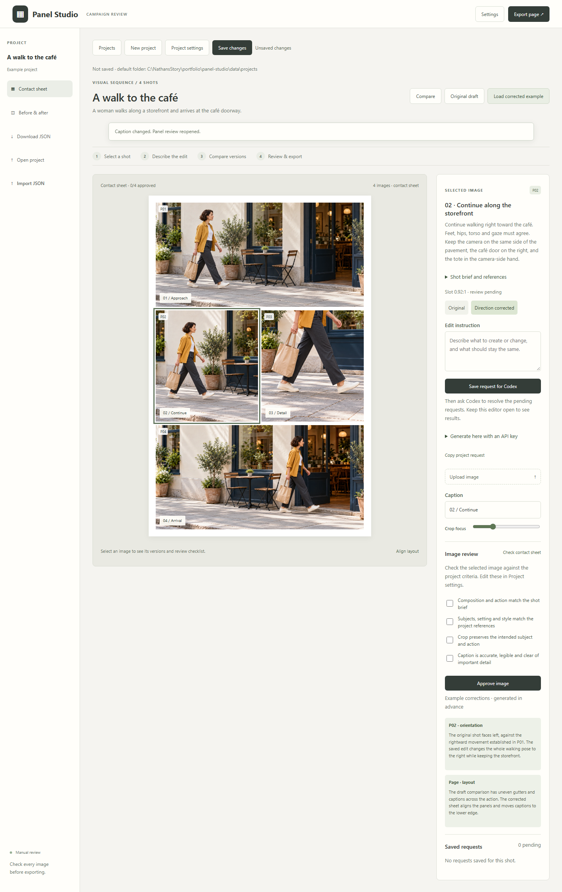

# Panel Studio

## Summary

A visual editor for arranging generated images into structured, printable panel sequences. Use it for short stories, manga and comics, storyboards, or other visual projects where the images need to work together.

Describe the story and shots, add references, then ask **ChatGPT Codex** to create or revise the artwork. The included plugin, skill and MCP server let Codex read your project, inspect images, return revisions and review the assembled page directly in the editor. You compare the results and decide what to approve.

Export the page as a **printable A4 or US Letter PDF** with optional crop marks and bleed (3 mm, ⅛ inch, or 5 mm to match your printer’s requirements). An **editable handoff ZIP** includes artwork and caption layers already sized and positioned for import into Photoshop or other image editors, plus source images and editable SVG captions. PDF pages retain a white border and use RGB colour.

## How to use it

1. **Open the editor.** With Node.js 22 or newer, run `npm start` and open **http://127.0.0.1:3741**. On Windows, you can also use `Start Panel Studio.cmd`.
2. **Create a project.** Describe the story or sequence, choose a page layout and art style, and write what happens in each shot. Add reference images if needed.
3. **Save instructions.** Select a shot, describe what to create or change, then click **Save request for Codex**.
4. **Ask Codex to work on it.** With the [Panel Studio plugin installed](docs/USER_GUIDE.md#use-with-codex), say: “Resolve the pending requests in my Panel Studio project, then review the page.” Keep the editor open. Codex uses its available image-generation tool; MCP delivers the results back to the project.
5. **Review and export.** Compare versions, adjust crops and captions, complete your review checks, and export the page.

Saving a request queues it; you start the work by asking Codex in chat. You can also upload artwork or generate directly in the editor with an OpenAI API key. The bundled example works without a key.

## What’s included

- Four-shot page presets, story and shot briefs, art direction and reference images.
- A Codex plugin and skill, with MCP tools for reading projects, viewing images, attaching revisions and inspecting pages.
- Saved projects, original artwork versions and before-and-after comparisons.
- Editable captions, crop controls and project-specific human review checks.
- PNG exports, sized print PDFs with bleed and crop marks, and an editable handoff ZIP with positioned layers.

Each project currently contains one four-shot page.

## More detail

[Illustrated walkthrough](docs/USER_GUIDE.md#the-codex-workflow-in-pictures) · [Setup and plugin installation](docs/USER_GUIDE.md#use-with-codex) · [Export guide](docs/USER_GUIDE.md#export-and-handoff) · [Design notes](docs/DESIGN.md) · [Tests and limitations](docs/VALIDATION.md)
