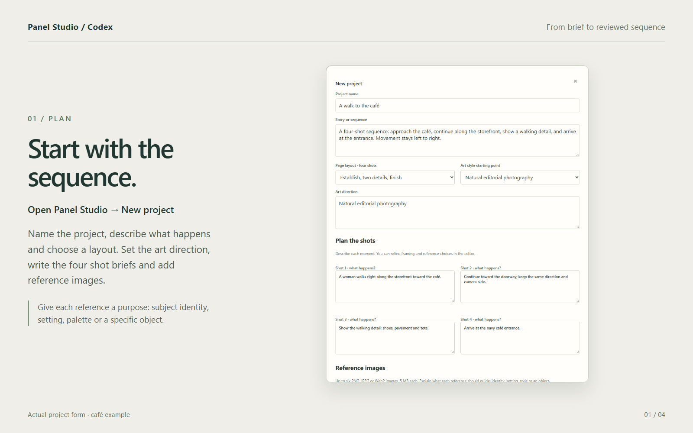
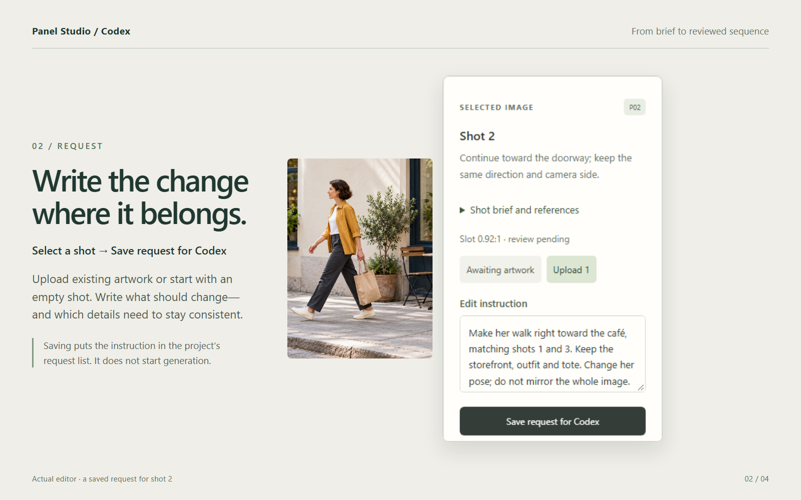
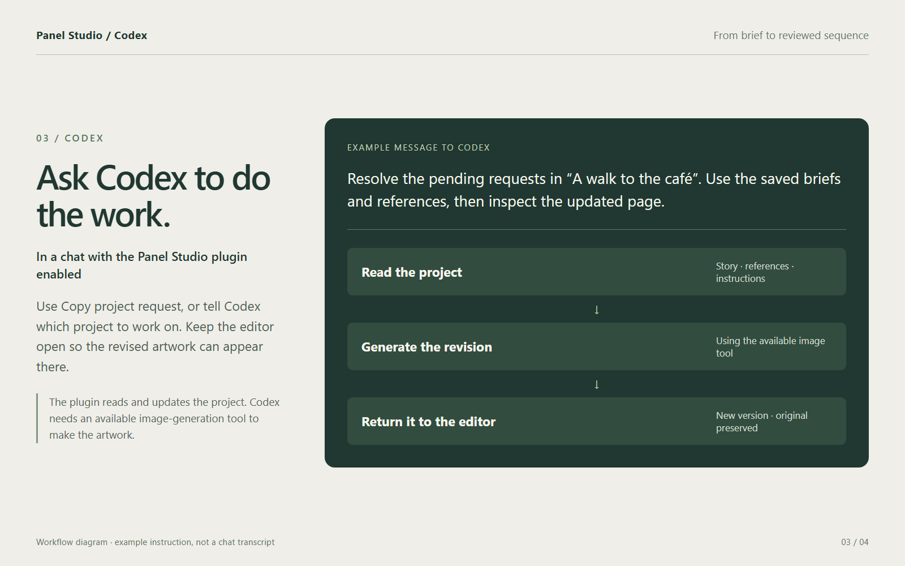
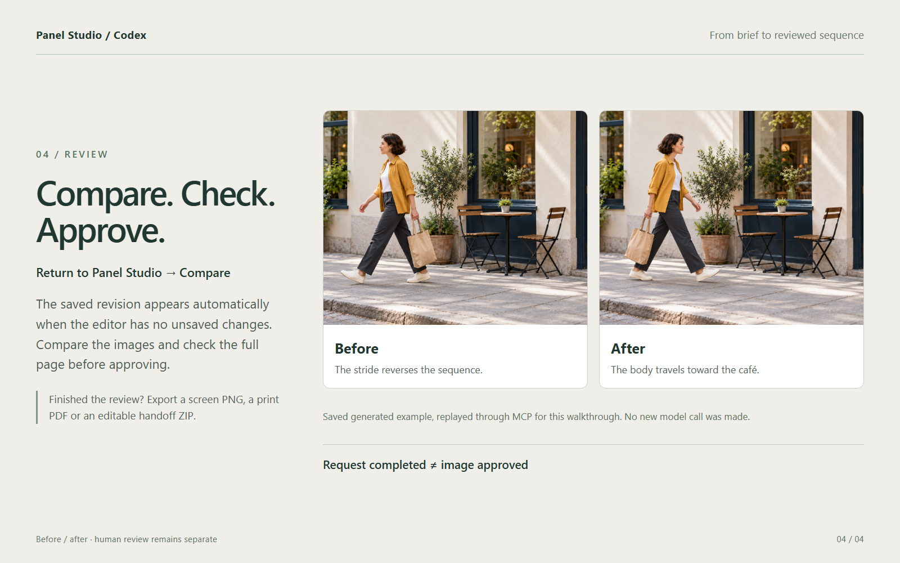
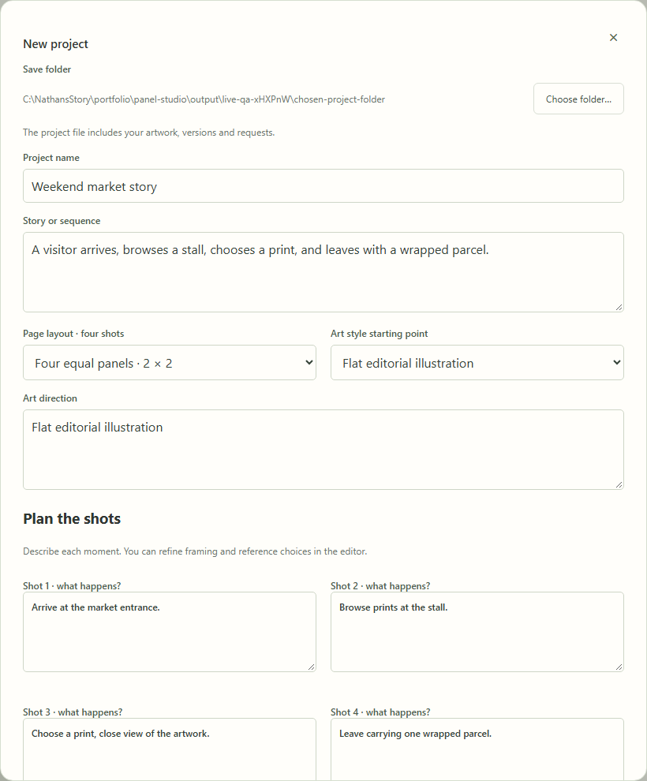
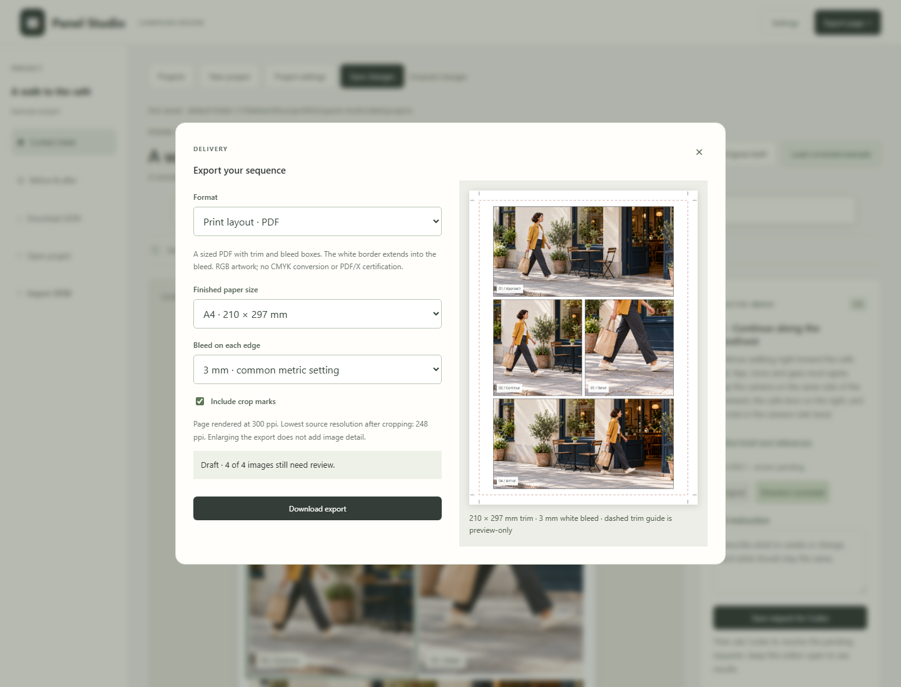

# Panel Studio user guide

Review a short image sequence, correct a selected shot, compare versions, and export the finished page. The example is a fictional adult walking toward a café. One shot deliberately reverses her direction; a saved generated edit corrects it without mirroring the storefront.


For the product rationale, architecture and next evaluation, read the [design case study](DESIGN.md). Completed checks and remaining validation are recorded in [validation](VALIDATION.md).

## The Codex workflow in pictures

Create a project, save a shot request, ask Codex to resolve it, then compare and review. These images use the actual editor and the saved café example; the Codex step is an explanatory diagram.






[Download or regenerate the walkthrough images](workflow/README.md).

## Run

With Node.js 22+, run `npm start` and open **http://127.0.0.1:3741**. No package installation is required. On Windows, you can also use `Start Panel Studio.cmd`.

The examples work without a key. For a new image revision or model review, enter your OpenAI key in Settings, or copy `.env.example` to `.env` and set `OPENAI_API_KEY`. Usage is billed to your API account. Keys entered in the UI stay in the tab's memory. Model names can be configured in `.env`; account access to those models is required.

## Start your own project

Choose **New project**, name it, describe the sequence, and choose an art style and a four-shot page preset. Write what happens in each shot. Add up to six PNG, JPEG or WebP references (5 MB each), with a role such as “subject identity” or “colour palette.” In each shot's **Shot brief and references**, choose its framing and which references apply.

**Project settings** lets you revise the story, style, layout and review criteria. Criteria apply to your project; the café example is not a required checklist. Empty shots stay unapproved until they have artwork. You can upload existing images, queue work for Codex, or open **Generate here with an API key** for direct generation.

**New project** shows the default save folder and a **Choose folder** button. **Save changes** writes back to that project file. The full path appears beneath the project toolbar. **Open project** opens the in-app file browser in the default `data/projects/` folder; **Import JSON** keeps the portable upload workflow. The default folder is excluded from Git, and custom locations are remembered locally for Codex access. **Projects** opens saved projects. **Download JSON** creates a portable backup; exporting a handoff ZIP embeds all artwork versions. Keep backups before moving or deleting the repository. Local saves are limited to 60 MB, and direct generation requests to 28 MB including encoded references.



## Review the example

1. Select P02. Compare its leftward stride with the rightward movement in P01 and P03.
2. Click **Load corrected example**. This loads a saved image edit and aligned layout; it makes no API call.
3. Click **Compare** for the original/current shot and page comparisons. The background stays oriented while the person's pose changes.
4. Adjust the crop or caption if needed. Complete the orientation, continuity, crop and lettering checks for each shot.
5. Approve the reviewed images, save the project JSON, and export the page PNG.

To make your own edit, enter an instruction and choose **Generate revision**. The selected image is the edit reference; the original remains in the version list. **Generate new** starts from the written shot brief. **Check contact sheet** sends the rendered page and briefs to OpenAI for suggestions. It does not approve the page. PNG, JPEG and WebP uploads are also supported.

The five source images, visual generation instructions, reference roles and visual findings are saved in [assets/movement-prompts.json](../assets/movement-prompts.json). The PNG originals are in `assets/demo-originals`; smaller WebP files serve the UI. These are generated demo images, not photographs of a real person or a real campaign. No private story material was used.

## Export and handoff

Choose **Export page** to preview and download the current sequence. Exports use your selected versions and current captions; they do not change review decisions or call an AI service.

| Format | Included | Intended use |
| --- | --- | --- |
| Screen PNG | 1,000, 2,000 or 3,000 px wide, with captions and no editor IDs | Presentations and review |
| Print PDF | A4 or US Letter, no bleed, 3 mm, ⅛ inch (3.175 mm) or 5 mm bleed, optional crop marks, explicit TrimBox and BleedBox | Sized artwork for print handoff |
| Handoff ZIP | Selected source artwork, eight positioned transparent PNG layers, SVG captions, preview, layout JSON, embedded project and instructions | Continued editing in Photoshop or a vector/layout application |

The 3 mm default follows common metric print practice. An exact ⅛ inch (3.175 mm) option accommodates US printer specifications; use 5 mm only when the recipient requests it. No bleed is also available for the white-bordered page. Check the recipient’s specification for both bleed and whether crop marks should be included. See [Adobe’s bleed guidance](https://www.adobe.com/learn/indesign/web/set-print-bleed?locale=en) and [Printing for Less specifications](https://www.printingforless.com/resources/graphic-design-layout-specifications-for-printing/).

The print layout fits the sequence proportionally inside the selected paper size. Its existing white border extends into the bleed; this is not an edge-to-edge artwork mode. The dashed trim guide appears only in the preview. Crop marks sit outside the bleed. The assembled page is rasterized at 300 ppi, while the dialog reports the lowest effective source resolution after cropping. Larger exports do not add detail to source images. Output is RGB, without a printer ICC conversion or PDF/X certification; confirm the recipient's colour and production requirements.

For Photoshop, unzip the handoff, use **File → Scripts → Load Files into Stack**, and select the PNGs in `layers/`. Leave automatic alignment off: all layers already use the same canvas size and position. Add a white background, and place each caption layer above its artwork. Caption PNGs are raster layers; `captions.svg` keeps text editable in a vector editor, and `layout.json` includes the caption strings for retyping. There is no native PSD export. Photoshop import has not been tested in Photoshop; layer positions were verified by reconstructing the composite and comparing it with the preview.

The default demo exports its original PNG artwork instead of the smaller display WebPs. User uploads retain their available source dimensions. `project.json` inside the ZIP embeds all versions so it can be reopened without relying on demo URLs.



## Use with Codex

Open this repository as a Codex project. The repo skill is discovered at `.agents/skills/panel-studio`. The project also includes a portable `plugin.json`, `mcp.json`, a supported Codex compatibility manifest, and a repo marketplace at `.agents/plugins/marketplace.json`, following the [OpenAI packaging guide](https://developers.openai.com/plugins/build/plugins).

For CLI installation, from this repository:

```sh
codex plugin marketplace add .
codex plugin add panel-studio@nathan-creative-tools
```

Start a new Codex session after installation. The desktop plugin picker can discover the repository marketplace when this folder is opened as a trusted project. This is a local plugin, not a public-directory submission.

Keep the local app running for the live workflow. The MCP connection defaults to `http://127.0.0.1:3741`; set `PANEL_STUDIO_URL` in its environment if you change the port. Installing the plugin supplies tools and the skill; it does not start the app or an autonomous background agent.

1. In the editor, select a shot, write what should change and click **Save request for Codex**.
2. Ask Codex: “Resolve the pending requests in my Panel Studio project.” **Copy project request** includes the project ID when you have several projects.
3. Codex reads the brief, images and references, generates the revision with its available image tool, then attaches it through MCP. Results appear in the open editor automatically.
4. Compare versions and complete your review checks. Request completion never approves artwork.

| Live tool | Behavior |
| --- | --- |
| `list_projects` | Find saved projects and pending requests. |
| `read_live_project` | Read story, style, shot briefs, reference roles, requests and measured slot geometry. |
| `read_live_image` | Inspect artwork or a reference; optionally save a new local reference file for generation. |
| `resolve_request` | Claim, block or complete a request with a guarded revision update. |
| `examine_live_page` | Inspect the editor's page preview only when it matches the current saved revision. |

The browser checks for changes every two seconds. Unsaved local edits stop remote refresh and show **Load latest**; save or back up your work before choosing to discard it. Generation requires an available image tool in Codex. If unavailable, the request remains blocked with a reason. The plugin itself needs no API key; the app's optional direct generation uses your OpenAI key.

The four offline tools remain available without the web server: `read_project`, `read_panel_image`, `update_panel` and `examine_page`. They work on exported JSON and page PNG files. Reopen file updates in the editor; offline PNG freshness must be checked manually. The file CLI is `node scripts/project.mjs inspect PROJECT.json` or `update PROJECT.json PATCH.json`. There is no MCP approval action.

The repo and plugin skill copies are kept identical by `npm run sync:skill`, and the test suite checks them.

## Verification and limits

`npm test` checks review gates, original-version preservation, project validation, mocked OpenAI contracts, the MCP handshake and native image results, revision conflicts, and plugin packaging. Codex CLI installation was tested in an isolated profile. Desktop/mobile browser workflows and actual exported images were inspected; evidence is in [docs/VALIDATION.md](VALIDATION.md).

The saved direction edit was generated and visually inspected with the built-in image tool. New paid requests through the app still need validation with your API key. Each project contains one four-shot page. Projects save locally; there is no chapter editor, cloud sync or team service. Changes reopen review. Screen export ranges from 1000×1532 to 3000×4596, and the UI uses the same slot proportions; inspect the exported PNG before sharing it.

To rerun browser checks: `npm install`, `npx playwright install chromium`, then `npm run test:browser` and `npm run test:live`. Playwright is a development dependency; it is not needed to run the app or MCP server.

Bundled export libraries and licenses are listed in [THIRD_PARTY.md](../THIRD_PARTY.md).
